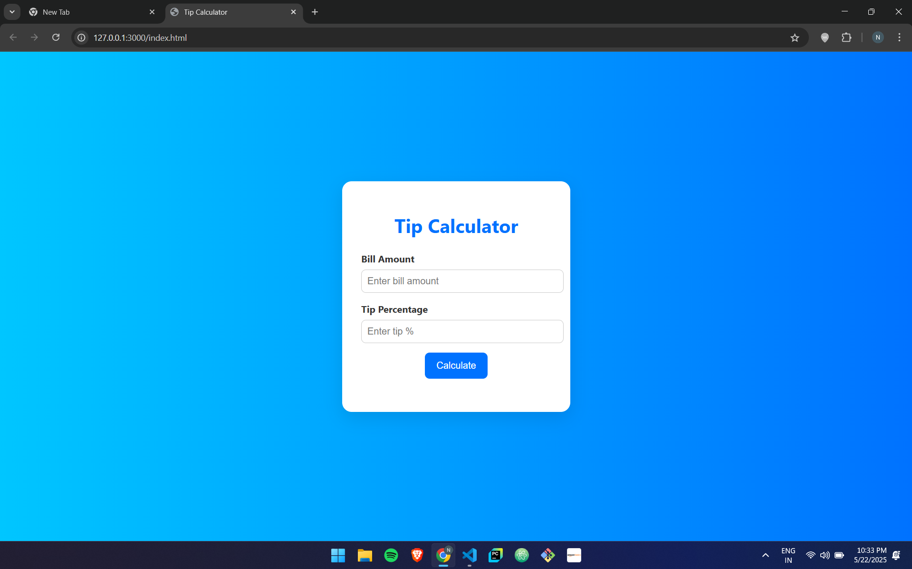

# 💰 Tip Calculator

A beautiful and simple web-based Tip Calculator built with HTML, CSS, and JavaScript.

## 🌟 Features
- Clean and modern UI with smooth UX
- Instant calculation of tip and total amount
- Responsive and mobile-friendly design

## 🛠️ Tech Stack
- HTML5
- CSS3
- JavaScript (Vanilla)

## 📸 Preview

  

## 🚀 How to Use
1. Clone the repository or download the files.
2. Open `index.html` in your browser.
3. Enter the bill amount and desired tip percentage.
4. Click **Calculate** to see the tip and total.
